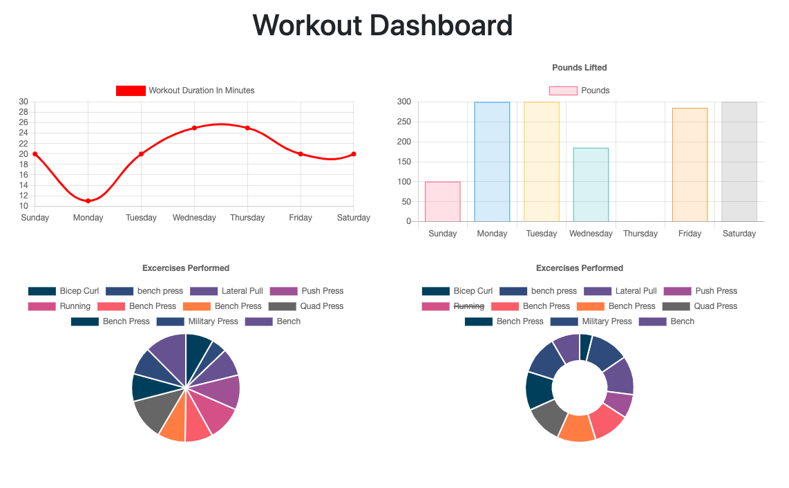

# workout-tracker

A full-stack Application for tracking workout data.

## Technologies used

- Node.js
- javascript
- mongoDB
- mongoose
- express
- heroku

## Project information

With this project I was tasked to setup the "Backend" to connect a pre-written front end.
To acheive this I setup a server with express and connected api and html routes. Using mongoose I setup Schema models to also be used in the CRUD operations of the api routes.

## Use this project

In order to use this project

- Fork and clone the repo.
- Run a npm install for the dependencies
- Create a mongo db
- In a new terminal Run the command npm run seed to pre seed data into the application
- Then run npm start to begin the application
